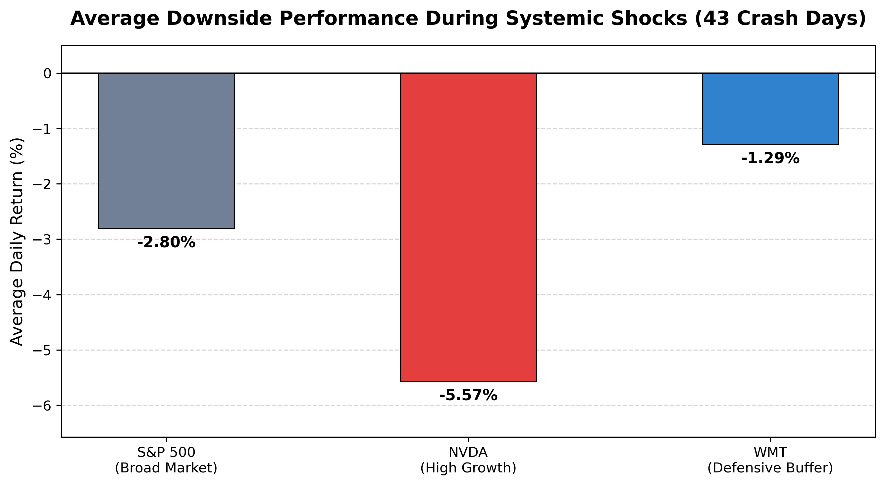

# Systemic Risk & Tail-Risk Stress Testing Model

An empirical data analytics engine built in Python to evaluate equity asset behavior during macro-driven liquidity shocks. This project filters five years of daily historical data to isolate systemic market capitulations and analyze non-linear downside correlations.

## 📊 Core Finding Summary

* **Nvidia (NVDA):** Risk Amplifier (1.99x Conditional Shock Beta). Suffered an average daily drop of **-5.57%** during market panics and maintained a **0.0%** Safe Haven Ratio.
* **Walmart (WMT):** Capital Shield (0.46x Conditional Shock Beta). Cushioned systemic drawdowns with an average daily drop of only **-1.29%**, actively closing in the green **18.6%** of the time.

## 🛠️ Tech Stack & Methodology
* **Language:** Python 3
* **Libraries:** `pandas`, `yfinance`, `matplotlib`, `numpy`
* **Condition Filter:** Isolated daily trading sessions where the S&P 500 (SPY) experienced a drawdown of <= -2.00% (yielding 43 distinct panic periods).
* **Metrics Derived:** Traditional 5-Year Monthly Beta vs. Daily Conditional Downside Beta.

## 🚀 Strategic Takeaway
Standard rolling multi-year monthly averages smooth out volatility and structurally underestimate tail risk for mega-cap growth equities. This quantitative stress-test model provides portfolio managers with an empirical framework to dynamically adjust Value-at-Risk (VaR) baselines and strategically allocate capital into defensive consumer staples during aggressive macro volatility.
